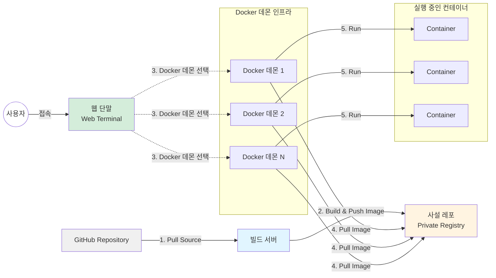

# container-bay

## 도커 데몬 실행 
#### 1. 명령어로 실행
$ sudo dockerd -H unix:///var/run/docker.sock -H tcp://0.0.0.0:2375 --tls=false

#### 2. 도커 설정 파일 수정한 뒤, 도커 데몬 실행 
...

## Container bay 다이어그램

```mermaid
graph LR
    GitHub[GitHub Repository]
    BuildServer[빌드 서버]
    PrivateRepo[사설 레포<br/>Private Registry]
    WebUI[웹 단말<br/>Web Terminal]
    User((사용자))
    
    subgraph "Docker 데몬 인프라"
        Daemon1[Docker 데몬 1]
        Daemon2[Docker 데몬 2]
        Daemon3[Docker 데몬 N]
    end
    
    subgraph "실행 중인 컨테이너"
        Container1[Container]
        Container2[Container]
        Container3[Container]
    end
    
    GitHub -->|1. Pull Source| BuildServer
    BuildServer -->|2. Build & Push Image| PrivateRepo
    User -->|접속| WebUI
    WebUI -.->|3. Docker 데몬 선택| Daemon1
    WebUI -.->|3. Docker 데몬 선택| Daemon2
    WebUI -.->|3. Docker 데몬 선택| Daemon3
    
    Daemon1 -->|4. Pull Image| PrivateRepo
    Daemon2 -->|4. Pull Image| PrivateRepo
    Daemon3 -->|4. Pull Image| PrivateRepo
    
    Daemon1 -->|5. Run| Container1
    Daemon2 -->|5. Run| Container2
    Daemon3 -->|5. Run| Container3
    
    style GitHub fill:#f0f0f0
    style BuildServer fill:#e1f5ff
    style PrivateRepo fill:#fff4e1
    style WebUI fill:#d4edda
    style User fill:#fff
```